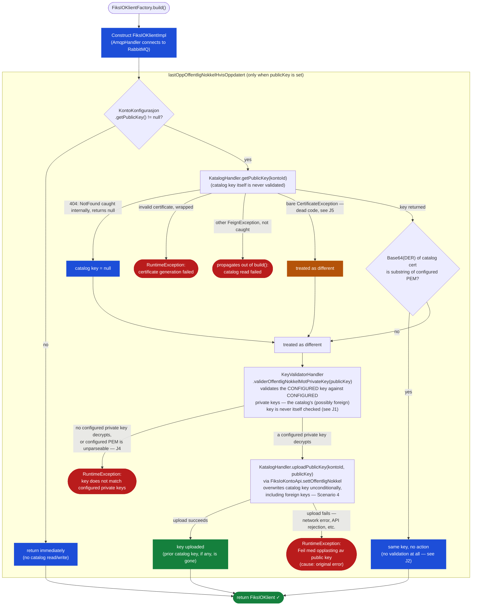

# Automatic Public Key Synchronization

## Background

Setting up a Fiks-IO account traditionally required the account's public key to be registered in the catalog manually by Fiks Forvaltning. This manual step can lead to coordination issues, especially when vendors need to rotate keys or set up accounts independently.
To streamline this, the Fiks-IO Java client can **automatically upload the configured public key to the catalog when the client is built**.

With automatic public key synchronization, the client uploads the configured public key to the Fiks-IO catalog when `FiksIOKlientFactory.build()` runs — eliminating the need for manual coordination. The municipality employee can set up the account independently and share the account details with the vendor afterward. The first time the vendor builds their client, the key is registered automatically.

---

## Configuration

Pass the public certificate (PEM-encoded X.509) alongside the private key(s) in `KontoKonfigurasjon`:

```java
// Single private key
KontoKonfigurasjon.builder()
    .kontoId(new KontoId(kontoId))
    .privatNokkel(privateKey)
    .publicKey(publicKeyPem)
    .build();

// Multiple private keys (key rotation)
KontoKonfigurasjon.builder()
    .kontoId(new KontoId(kontoId))
    .privatNokkel(oldPrivateKey)
    .privatNokkel(newPrivateKey)
    .publicKey(newPublicKeyPem)
    .build();
```

`publicKey` is optional. Omitting it disables automatic upload entirely — the client neither reads nor writes the catalog key at build time. Note that uploading a key requires the account to have API-based configuration enabled at Fiks Forvaltning; without this, `uploadPublicKey` fails.

---

## Is the feature enabled?

Automatic upload runs **if and only if `publicKey` is set (non-null) on `KontoKonfigurasjon`**. There is no dedicated boolean flag or startup log line indicating enabled/disabled state — you can only tell by inspecting the configuration you built (`kontoKonfigurasjon.getPublicKey() != null`). Unlike a design where validation always runs regardless of the flag, in this client **no catalog read or private-key validation happens at all when `publicKey` is omitted** — the client simply skips straight to building the AMQP connection.

If you want to verify that a running client's key matches what is currently registered in the catalog (regardless of whether upload is configured), call the public method on the built client:

```java
Boolean matches = fiksIOKlient.validerOffentligNokkelMotPrivateKey();
```

;This fetches the current catalog key and checks it against the configured private key(s) on demand — useful for health checks or diagnostics. **`validerOffentligNokkelMotPrivateKey()` itself is never invoked automatically by `build()`.** What runs automatically is validation of the *configured* `publicKey` (via the overload `validerOffentligNokkelMotPrivateKey(String)`) — and only when `build()` first determines that the configured key differs from whatever is currently registered in the catalog. If the configured key is identical to the catalog's, no validation of any kind takes place (see [Known Limitations](#known-limitations)).

---

## How It Works

`FiksIOKlientFactory.build()` runs synchronously (there is no async/await in this client) and performs the following steps, in order:

1. Sets up the Maskinporten client, dokumentlager client, and `FiksIOUtsendingKlient`.
2. Builds `AsicHandler`, `KatalogHandler`, `FiksIOHandler`, and `KeyValidatorHandler`.
3. Constructs `FiksIOKlientImpl`, which internally creates an `AmqpHandler` — **this already opens the RabbitMQ connection**.
4. Only after the client (and its AMQP connection) has been assembled, `build()` calls `lastOppOffentligNokkelHvisOppdatert(...)`, which performs the key synchronization described below.
5. Returns the built `FiksIOKlient`.

> **Important difference from a "validate before connecting" design:** in this client, the AMQP connection is already open by the time the public key check runs. If the key check fails and `build()` throws, the already-open AMQP connection is **not** explicitly closed by the surrounding `catch` block (only the dokumentlager and utsending HTTP clients are). See [Known Limitations](#known-limitations).

`lastOppOffentligNokkelHvisOppdatert` (in `FiksIOKlientFactory`):

1. Reads `publicKey` from `KontoKonfigurasjon`. If it is `null`, returns immediately — no catalog read, no write.
2. Otherwise calls `KatalogHandler.getPublicKey(kontoId)` against the **unauthenticated** public catalog endpoint:
   - If the catalog has no key registered, the underlying HTTP call throws `FeignException.NotFound` — but `getPublicKey` catches this internally and simply **returns `null`**; the exception never reaches the caller.
   - If the catalog returns an invalid/unparseable certificate, `getPublicKey` throws a `RuntimeException`.
   - Any other HTTP failure (5xx, timeout, etc.) is **not** caught by `getPublicKey` and propagates out of it as an unchecked `FeignException`.
   - The comparison helper (`offentligNokkelUlikFraFiksIOKatalog`) also has a `catch (FeignException.NotFound | CertificateException e)` clause that treats a caught `CertificateException` the same as "no key registered" (i.e. as **different**, triggering validation/upload). In practice this branch is **dead code**: `KatalogHandler.getPublicKey` already catches any `CertificateException` internally and rethrows it wrapped as a `RuntimeException` (see the bullet above), so a bare `CertificateException` can never actually reach this `catch` clause under the current implementation.
3. Compares the catalog result with the configured `publicKey`:
   - If the catalog key is `null` (nothing registered) → treated as **different**.
   - Otherwise, the Base64-encoded DER bytes of the catalog certificate are checked as a **substring** of the configured PEM (with newlines stripped). This is a raw text/byte comparison — not a `SubjectPublicKeyInfo`-based comparison.
4. If the keys are the same → nothing happens, `build()` proceeds.
5. If the keys differ → `KeyValidatorHandler.validerOffentligNokkelMotPrivateKey(publicKey)` is called: it parses the configured `publicKey` as an `X509Certificate`, encrypts 256 random bytes (CMS, via `CMSKrypteringImpl`) with it, and tries decrypting with each configured private key in turn.
   - If **any** configured private key decrypts successfully → the key is ours → `KatalogHandler.uploadPublicKey(kontoId, publicKey)` is called, which invokes `FiksIoKontoApi.settOffentligNokkel(...)`. `FiksIOKlientFactory` always constructs a non-null `FiksIoKontoApi` for this call (the `kontoApi == null` guard inside `KatalogHandler` is unreachable via `build()`); the account must still have API-based configuration enabled for the upload call itself to succeed. Any failure during the upload (network error, API rejection, etc.) is caught by `lastOppOffentligNokkel` and rethrown as `RuntimeException("Feil med opplasting av public key", e)`, with the original failure as the cause.
   - If **no** configured private key decrypts it → throws `RuntimeException("Offentlignøkkel kan ikke valideres opp mot konfigurerte private nøkler")`, and `build()` fails.

Two things to note that differ from a design with independent, always-on validation:

- **Nothing is validated when `publicKey` is not configured.** There is no fail-fast startup check against whatever key currently sits in the catalog unless you opt in by setting `publicKey`, or by explicitly calling `fiksIOKlient.validerOffentligNokkelMotPrivateKey()` yourself after the client is built.
- **A transient catalog failure during the check is fatal whenever `publicKey` is configured** — any exception other than "not found" propagates out of `build()` (caught by the outer `catch (Exception e)`, which closes the dokumentlager/utsending clients and rethrows). There is no "log a warning and continue" fallback path for feature-enabled clients.

---

## Flow Diagram



---

## Scenarios

### Scenario 1 — First-time setup: no key in catalog

**Precondition:** A new account has been created. No public key has been registered yet. `publicKey` is configured.

**Flow:**
1. The catalog returns 404; `KatalogHandler.getPublicKey` catches the underlying `FeignException.NotFound` internally and returns `null` — no exception reaches `lastOppOffentligNokkelHvisOppdatert`
2. Comparison treats this as different → validation runs
3. `KeyValidatorHandler.validerOffentligNokkelMotPrivateKey(publicKey)` confirms one of the configured private keys matches
4. `KatalogHandler.uploadPublicKey(kontoId, publicKey)` uploads the key via `FiksIoKontoApi.settOffentligNokkel`
5. `build()` returns the client

**Result:** Key is registered. Subsequent senders will encrypt messages using this key.

---

### Scenario 2 — Key already current

**Precondition:** The public key in the catalog is identical to the configured `publicKey`.

**Flow:**
1. `KatalogHandler.getPublicKey` returns the existing certificate
2. The Base64(DER) substring check matches
3. No upload; `build()` returns immediately

**Result:** Nothing happens on the catalog side.

---

### Scenario 3 — Key rotation: replacing our own old key

**Precondition:** The catalog has an existing key that one of the configured private keys can still decrypt. The vendor generated a new key pair and wants to rotate.

**Configuration:**
```java
KontoKonfigurasjon.builder()
    .kontoId(new KontoId(kontoId))
    .privatNokkel(oldPrivateKey)
    .privatNokkel(newPrivateKey)
    .publicKey(newPublicKeyPem)
    .build();
```

**Flow:**
1. Catalog returns the old certificate; comparison against `newPublicKeyPem` finds it different
2. `validerOffentligNokkelMotPrivateKey(newPublicKeyPem)` succeeds because `newPrivateKey` is in the configured list
3. `uploadPublicKey` replaces the catalog key with the new certificate

**Message decryption during rotation:**

Messages already on the queue were encrypted with the old public key. All configured private keys (`privatNokler`) are passed together to `AsicHandler` (via `AsicHandler.builder().withPrivateNokler(...)`, from the external `asic-klient` library); actual decryption — including trying multiple private keys against an incoming message — is handled inside that library, not in this client's own code:

Conceptually (exact ordering is an internal detail of `asic-klient`, not specified by this client):

```
Old message arrives (encrypted with oldPubCert)
  → decrypts successfully with oldPrivateKey (whichever of the configured keys matches) ✅

New message arrives (encrypted with newPubCert)
  → decrypts successfully with newPrivateKey ✅
```

**When is it safe to remove the old private key?** When you are confident the queue no longer contains messages encrypted with the old key. There is no built-in indicator for this — it is an operational decision.

---

### Scenario 4 — Catalog has an unrelated key

> ⚠️ **Warning:** This scenario does **not** fail. Automatic public key sync validates only the *configured* key against the *configured* private keys — it never validates or checks ownership of whatever key is already sitting in the catalog. If the configured key pair is internally consistent, the foreign catalog key is silently overwritten. See [Known Limitations: J1](#known-limitations) for the underlying gap.

**Precondition:** The catalog already has a public key registered that does **not** belong to this client's configured key pair — e.g. the account was previously set up by someone else, a decommissioned account's `kontoId` is being reused, or the wrong `kontoId` was targeted. The *configured* `publicKey` and configured private key(s), however, are a valid, self-consistent pair.

**Flow:**
1. `KatalogHandler.getPublicKey` returns the existing (foreign) certificate from the catalog
2. The Base64(DER)-substring comparison finds it different from the configured `publicKey` → treated as **different**
3. `KeyValidatorHandler.validerOffentligNokkelMotPrivateKey(publicKey)` validates the **configured** `publicKey` against the **configured** private keys only — the catalog's (foreign) key is never itself validated or checked against anything — and succeeds, because the configured pair is self-consistent
4. `KatalogHandler.uploadPublicKey` overwrites the catalog's foreign key with the configured `publicKey`, with no ownership check and no confirmation step

**Result:** `build()` succeeds, and the previously-registered (foreign) key in the catalog is unconditionally replaced. If that key legitimately belonged to another party or a different deployment, their registration is silently clobbered — there is no log line, warning, or error surfaced anywhere in this path. See [Known Limitations](#known-limitations) item **J1** (no ownership check of an existing catalog key).

> **Related failure mode:** If instead the *configured* `publicKey` does not correspond to any *configured* private key (a genuine local misconfiguration, independent of what is in the catalog), `validerOffentligNokkelMotPrivateKey` returns `false` and `build()` throws `RuntimeException("Offentlignøkkel kan ikke valideres opp mot konfigurerte private nøkler")` instead — no upload happens, and the AMQP connection opened earlier in `build()` (step 3 of [How It Works](#how-it-works)) is **not** explicitly closed in this failure path, only the dokumentlager and utsending HTTP clients are. Note that this is the *exact same* exception message produced by an unparseable configured PEM — see [Scenario 7](#scenario-7--invalid-configured-public-key-pem) and [Known Limitations](#known-limitations) item **J4**.

---

### Scenario 5 — Catalog unavailable during build()

**Precondition:** `publicKey` is configured and the Fiks-IO catalog API is temporarily unreachable (network issue, 5xx — **not** a 404).

**Flow:**
1. `KatalogHandler.getPublicKey` lets the underlying `FeignException` (not `FeignException.NotFound`) propagate — it is only caught for the 404 case
2. The exception propagates out of `lastOppOffentligNokkelHvisOppdatert` and out of `build()`
3. The outer `try`/`catch` in `build()` closes the dokumentlager and utsending clients, then rethrows

**Result:** `build()` throws. Retry on the next attempt. As noted above, there is no "log and continue" fallback here — a transient catalog outage is fatal whenever `publicKey` is configured.

---

### Scenario 6 — Feature not configured

**Precondition:** `KontoKonfigurasjon` is built without `.publicKey(...)`.

```java
KontoKonfigurasjon.builder()
    .kontoId(new KontoId(kontoId))
    .privatNokkel(privateKey)
    .build();
```

**Flow:**
1. `getPublicKey()` on the configuration is `null`
2. `lastOppOffentligNokkelHvisOppdatert` returns immediately — no catalog read, no write, no validation
3. `build()` proceeds straight to returning the client

**Result:** No key upload or validation is performed at build time. If the catalog's registered key does not match any configured private key, this will only surface later — either when an incoming message cannot be decrypted, or if you explicitly call `fiksIOKlient.validerOffentligNokkelMotPrivateKey()` yourself.

---

### Scenario 7 — Invalid configured public key (PEM)

**Precondition:** `publicKey` is configured, but the string is not a well-formed X.509 PEM certificate (e.g. truncated, corrupted, or not actually a certificate), and the catalog's currently registered key (if any) differs from it.

**Flow:**
1. `KatalogHandler.getPublicKey` returns the catalog's key (or `null`); the comparison against the malformed configured `publicKey` finds it different — malformed input cannot match, so this always falls through to validation
2. `KeyValidatorHandler.validerOffentligNokkelMotPrivateKey(String)` tries to parse the configured `publicKey` via `CertificateFactory.generateCertificate(...)`, which throws `CertificateException`
3. That `CertificateException` is caught **inside** `validerOffentligNokkelMotPrivateKey(String)` and the method simply returns `false` — the parse failure is swallowed and never surfaced as its own error
4. `build()` sees `false` and throws `RuntimeException("Offentlignøkkel kan ikke valideres opp mot konfigurerte private nøkler")`

**Result:** `build()` fails with the **exact same message** as a genuine key/private-key mismatch (see [Scenario 4](#scenario-4--catalog-has-an-unrelated-key)'s "Related failure mode" note). There is nothing in the exception text or type to indicate the real cause was a malformed PEM rather than a correct-but-non-matching key — you must inspect the configured `publicKey` value yourself to tell the two apart. See [Known Limitations](#known-limitations) item **J4**.

---

## Key Rotation Step-by-Step Guide

1. **Generate a new key pair** (e.g. with OpenSSL or a PKI tool). Private keys must be in PKCS#8 format (convert PKCS#1 keys with `openssl pkcs8 -topk8 -nocrypt -in <pkcs1> -out <pkcs8>`).
2. **Update configuration** — add the new private key alongside the old one, and set the new public certificate as `publicKey`:
   ```java
   KontoKonfigurasjon.builder()
       .kontoId(new KontoId(kontoId))
       .privatNokkel(oldPrivateKey)
       .privatNokkel(newPrivateKey)
       .publicKey(newPublicKeyPem)
       .build();
   ```
3. **Deploy and rebuild the client** — `FiksIOKlientFactory.build()` uploads the new public key to the catalog.
4. **Wait** until you are confident the queue is drained of messages encrypted with the old key.
5. **Remove the old private key** from the configuration and redeploy:
   ```java
   KontoKonfigurasjon.builder()
       .kontoId(new KontoId(kontoId))
       .privatNokkel(newPrivateKey)
       .publicKey(newPublicKeyPem)
       .build();
   ```

---

## Known Limitations

- **No expiry awareness:** Certificate validity dates are not checked. An expired certificate in the catalog will not be replaced automatically unless the configured `publicKey` differs from it.
- **No rotation drain indicator:** There is no built-in signal for when it is safe to remove an old private key. This is left to the operator.
- **Sync is build()-time only, and opt-in:** Synchronization runs once, synchronously, inside `FiksIOKlientFactory.build()`, and **only** when `publicKey` is configured. If the catalog key changes afterward, nothing detects it until the client is rebuilt, and nothing detects it at all if `publicKey` was never configured — unless you call `validerOffentligNokkelMotPrivateKey()` yourself.
- **Comparison is a raw string/byte check, not `SubjectPublicKeyInfo`-based:** The client checks whether the Base64(DER) of the catalog certificate appears as a substring of the configured PEM text, rather than parsing and comparing public key material structurally.
- **AMQP connection may be left open on failure:** The RabbitMQ connection is established when `FiksIOKlientImpl`/`AmqpHandler` is constructed, which happens *before* the key check runs. If the key check subsequently throws, `build()`'s `catch` block closes the dokumentlager and utsending HTTP clients but does not close this AMQP connection.
- **Requires API-based account configuration to upload:** `uploadPublicKey` calls the authenticated `FiksIoKontoApi`, which `FiksIOKlientFactory` always provides when building via `build()`. If the account does not have API-based configuration enabled at Fiks Forvaltning, the upload call itself fails, and `lastOppOffentligNokkel` rewraps that failure as `RuntimeException("Feil med opplasting av public key", e)`.
- **No dedicated exception types:** All failures in this flow surface as plain `RuntimeException` (or the underlying `FeignException`/`CertificateException`), not a dedicated exception type for "key not found" vs. "misconfigured" vs. "catalog unavailable".
- **Concurrent builds during rotation:** If several client instances are built simultaneously with different `publicKey` values during a rollout, they can repeatedly overwrite each other's catalog key until the rollout converges. Roll out a key change to all instances together.
- **No ownership check of an existing catalog key (J1):** Before overwriting a differing catalog key, the client only checks whether the *configured* `publicKey` matches one of the *configured* private keys — it never checks whether the key currently registered in the catalog belongs to (or was ever validated against) this account's private keys. An unrelated/foreign key already sitting in the catalog is silently overwritten as long as the new configured key validates against the configured private keys. See [Scenario 4](#scenario-4--catalog-has-an-unrelated-key).
- **No validation when the keys are equal (J2):** If the configured `publicKey` matches the catalog key (per the substring comparison above), `validerOffentligNokkelMotPrivateKey` is never called and no private-key/public-key validation happens at all. A configured `publicKey` that doesn't actually correspond to any configured private key will go undetected for as long as it matches the catalog.
- **Invalid configured PEM is indistinguishable from a genuine mismatch (J4):** If the configured `publicKey` is not a parseable X.509 PEM, `KeyValidatorHandler.validerOffentligNokkelMotPrivateKey(String)` catches the resulting `CertificateException` internally and simply returns `false`. `build()` then throws the exact same `RuntimeException("Offentlignøkkel kan ikke valideres opp mot konfigurerte private nøkler")` as it would for a correctly-formed key that just doesn't match any configured private key — there is no way to tell "malformed PEM" apart from "wrong key" from the exception message alone. See [Scenario 7 — Invalid configured public key (PEM)](#scenario-7--invalid-configured-public-key-pem).
- **No logging or flag for enabled/disabled status (J7):** As noted in [Is the feature enabled?](#is-the-feature-enabled), there is no log line, metric, or dedicated flag emitted at build time indicating whether automatic sync ran, was skipped, or which branch (same/different/upload) was taken. The only way to know is to inspect `kontoKonfigurasjon.getPublicKey()` yourself or read the (non-dedicated) `RuntimeException`/`FeignException` thrown on failure.

---

## Differences from the .NET client

The Fiks-IO **.NET** client's automatic public key sync feature is documented separately and behaves differently from this Java client in several important respects. If you have worked with (or read documentation for) the .NET client, do **not** assume the same guarantees hold here. The known behavioral differences are:

| Aspect | This Java client | .NET client (as documented there) |
|---|---|---|
| When validation runs | Only when the configured `publicKey` differs from the catalog's key (substring comparison); if they're equal, **nothing** is validated (J2) | Runs its own validation independent of whether the flag/config differs |
| What gets validated | Only the **configured** `publicKey` against the **configured** private key(s); the pre-existing catalog key is never itself validated or ownership-checked (J1) | Documented to include checks that are not mirrored here — do not assume catalog-side ownership checks exist in this client |
| Overwriting a foreign/unrelated catalog key | Silently overwritten as soon as the configured key pair validates against itself — see [Scenario 4](#scenario-4--catalog-has-an-unrelated-key) | Not applicable in the same way; behavior differs per .NET documentation |
| Connection ordering | The AMQP connection is already open (via `FiksIOKlientImpl`/`AmqpHandler`) **before** the key sync/validation step runs; a failed check does not close it | A "validate before connecting" style ordering is assumed by some existing prose in this repo describing a *different* design — that description does **not** apply to this Java client's actual `build()` order (see [How It Works](#how-it-works)) |
| Malformed configured PEM vs. genuine mismatch | Indistinguishable — both produce the identical `RuntimeException` message (J4) | Not verified here; do not assume equivalent error granularity |
| Enabled/disabled visibility | No dedicated flag or log line; inferred only from `getPublicKey() != null` (J7) | Not verified here; do not assume equivalent logging/observability |
| Exception types | Plain `RuntimeException`/`FeignException`/`CertificateException` throughout, no dedicated exception hierarchy | Not verified here |

**Takeaway:** this document describes the Java client's actual, current behavior only. Where earlier sections above contrast this client against "a design that validates independently" or "validates before connecting," that phrasing describes a hypothetical/alternate design for illustration — it is **not** a confirmed description of the .NET client's implementation. Consult the .NET client's own documentation for its actual behavior rather than inferring it from this file.
