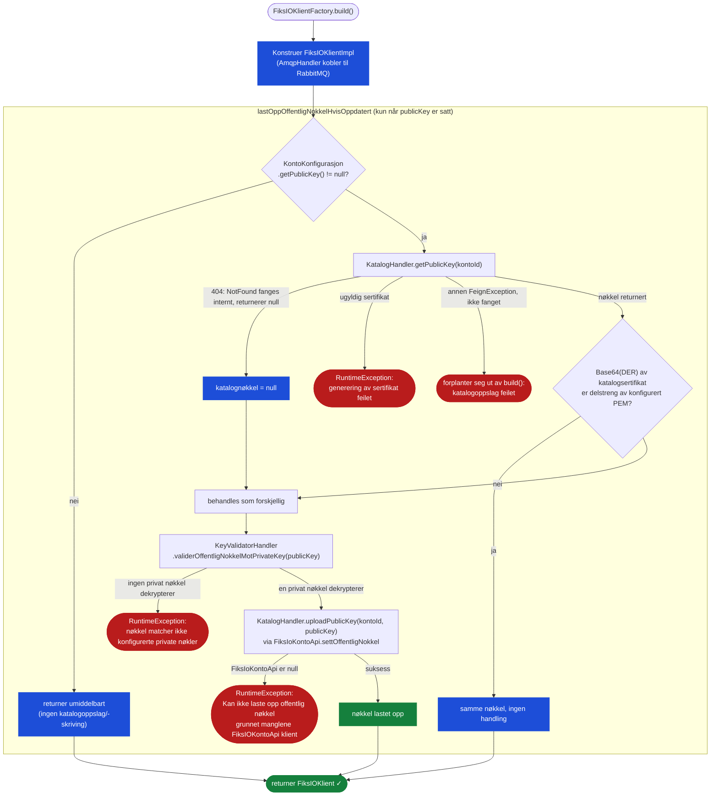

# Automatisk synkronisering av offentlig nøkkel

## Bakgrunn

Å sette opp en Fiks-IO-konto har tradisjonelt krevd at kontoens offentlige nøkkel ble registrert manuelt i katalogen av Fiks Forvaltning. Dette manuelle steget kan føre til koordineringsutfordringer, spesielt når leverandører trenger å rotere nøkler eller sette opp kontoer på egen hånd.
For å forenkle dette kan Fiks-IO Java-klienten **automatisk laste opp den konfigurerte offentlige nøkkelen til katalogen når klienten bygges**.

Med automatisk synkronisering av offentlig nøkkel laster klienten opp den konfigurerte offentlige nøkkelen til Fiks-IO-katalogen når `FiksIOKlientFactory.build()` kjøres — dette eliminerer behovet for manuell koordinering. Kommunens ansatte kan sette opp kontoen uavhengig og dele kontoopplysningene med leverandøren i etterkant. Første gang leverandøren bygger klienten sin, blir nøkkelen registrert automatisk.

---

## Konfigurasjon

Send med det offentlige sertifikatet (PEM-kodet X.509) sammen med den/de private nøkkelen/nøklene i `KontoKonfigurasjon`:

```java
// Én privat nøkkel
KontoKonfigurasjon.builder()
    .kontoId(new KontoId(kontoId))
    .privatNokkel(privateKey)
    .publicKey(publicKeyPem)
    .build();

// Flere private nøkler (nøkkelrotasjon)
KontoKonfigurasjon.builder()
    .kontoId(new KontoId(kontoId))
    .privatNokkel(oldPrivateKey)
    .privatNokkel(newPrivateKey)
    .publicKey(newPublicKeyPem)
    .build();
```

`publicKey` er valgfritt. Utelates den, deaktiveres automatisk opplasting fullstendig — klienten verken leser eller skriver katalognøkkelen ved bygging. Merk at opplasting av en nøkkel krever at kontoen har API-basert konfigurasjon aktivert hos Fiks Forvaltning; uten dette vil `uploadPublicKey` feile.

---

## Er funksjonen aktivert?

Automatisk opplasting kjører **hvis og bare hvis `publicKey` er satt (ikke null) på `KontoKonfigurasjon`**. Det finnes ingen egen boolsk flagg eller loggmelding ved oppstart som indikerer om funksjonen er aktivert eller deaktivert — du kan bare avgjøre dette ved å inspisere konfigurasjonen du bygde (`kontoKonfigurasjon.getPublicKey() != null`). I motsetning til et design der validering alltid kjører uavhengig av flagget, skjer det i denne klienten **ingen katalogoppslag eller validering av private nøkler i det hele tatt** når `publicKey` er utelatt — klienten går rett videre til å bygge AMQP-forbindelsen.

Hvis du vil verifisere at nøkkelen til en kjørende klient stemmer med det som er registrert i katalogen (uavhengig av om opplasting er konfigurert), kan du kalle den offentlige metoden på den bygde klienten:

```java
Boolean matches = fiksIOKlient.validerOffentligNokkelMotPrivateKey();
```

Denne henter gjeldende katalognøkkel og sjekker den mot den/de konfigurerte private nøkkelen/nøklene på forespørsel — nyttig for helsesjekker eller diagnostikk, men den kalles **ikke** automatisk med mindre `publicKey` er konfigurert (se under).

---

## Hvordan det fungerer

`FiksIOKlientFactory.build()` kjører synkront (det finnes ingen async/await i denne klienten) og utfører følgende steg, i rekkefølge:

1. Setter opp Maskinporten-klienten, dokumentlager-klienten og `FiksIOUtsendingKlient`.
2. Bygger `AsicHandler`, `KatalogHandler`, `FiksIOHandler` og `KeyValidatorHandler`.
3. Konstruerer `FiksIOKlientImpl`, som internt oppretter en `AmqpHandler` — **dette åpner allerede RabbitMQ-forbindelsen**.
4. Først etter at klienten (og AMQP-forbindelsen) er satt sammen, kalles `lastOppOffentligNokkelHvisOppdatert(...)`, som utfører nøkkelsynkroniseringen beskrevet under.
5. Returnerer den bygde `FiksIOKlient`.

> **Viktig forskjell fra et design som «validerer før tilkobling»:** i denne klienten er AMQP-forbindelsen allerede åpnet når sjekken av offentlig nøkkel kjører. Hvis nøkkelsjekken feiler og `build()` kaster et unntak, blir den allerede åpne AMQP-forbindelsen **ikke** eksplisitt lukket av den omkringliggende `catch`-blokken (kun dokumentlager- og utsendingsklientene for HTTP lukkes). Se [Kjente begrensninger](#kjente-begrensninger).

`lastOppOffentligNokkelHvisOppdatert` (i `FiksIOKlientFactory`):

1. Leser `publicKey` fra `KontoKonfigurasjon`. Hvis den er `null`, returnerer metoden umiddelbart — ingen katalogoppslag, ingen skriving.
2. Ellers kalles `KatalogHandler.getPublicKey(kontoId)` mot det **uautentiserte** offentlige katalog-endepunktet:
   - Hvis katalogen ikke har noen registrert nøkkel, kaster det underliggende HTTP-kallet `FeignException.NotFound` — men `getPublicKey` fanger dette internt og **returnerer bare `null`**; unntaket når aldri kalleren.
   - Hvis katalogen returnerer et ugyldig/uleselig sertifikat, kaster `getPublicKey` en `RuntimeException`.
   - Alle andre HTTP-feil (5xx, timeout osv.) fanges **ikke** av `getPublicKey` og forplanter seg ut av den som en usjekket `FeignException`.
3. Sammenligner katalogresultatet med den konfigurerte `publicKey`:
   - Hvis katalognøkkelen er `null` (ingenting registrert) → behandles som **forskjellig**.
   - Ellers sjekkes det om de Base64-kodede DER-bytene til katalogsertifikatet finnes som en **delstreng** i den konfigurerte PEM-en (med linjeskift fjernet). Dette er en ren tekst-/bytesammenligning — ikke en sammenligning basert på `SubjectPublicKeyInfo`.
4. Hvis nøklene er like → skjer det ingenting, `build()` fortsetter.
5. Hvis nøklene er forskjellige → kalles `KeyValidatorHandler.validerOffentligNokkelMotPrivateKey(publicKey)`: den tolker den konfigurerte `publicKey` som et `X509Certificate`, krypterer 256 tilfeldige bytes (CMS, via `CMSKrypteringImpl`) med den, og forsøker å dekryptere med hver konfigurerte private nøkkel etter tur.
   - Hvis **en hvilken som helst** konfigurert privat nøkkel dekrypterer vellykket → nøkkelen er vår → `KatalogHandler.uploadPublicKey(kontoId, publicKey)` kalles, som igjen kaller `FiksIoKontoApi.settOffentligNokkel(...)` (krever kontoens autentiserte `FiksIoKontoApi`; API-basert konfigurasjon må være aktivert for kontoen).
   - Hvis **ingen** konfigurert privat nøkkel dekrypterer den → kastes `RuntimeException("Offentlignøkkel kan ikke valideres opp mot konfigurerte private nøkler")`, og `build()` feiler.

To ting som skiller seg fra et design med uavhengig, alltid-på validering:

- **Ingenting valideres når `publicKey` ikke er konfigurert.** Det finnes ingen fail-fast-sjekk ved oppstart mot hva som enn ligger i katalogen, med mindre du velger å sette `publicKey`, eller eksplisitt kaller `fiksIOKlient.validerOffentligNokkelMotPrivateKey()` selv etter at klienten er bygget.
- **En forbigående katalogfeil under sjekken er fatal når `publicKey` er konfigurert** — alle unntak bortsett fra «ikke funnet» forplanter seg ut av `build()` (fanges av den ytre `catch (Exception e)`, som lukker dokumentlager-/utsendingsklientene og kaster unntaket videre). Det finnes ingen «logg en advarsel og fortsett»-løsning for klienter med funksjonen aktivert.

---

## Flytdiagram



---

## Scenarier

### Scenario 1 — Førstegangsoppsett: ingen nøkkel i katalogen

**Forutsetning:** En ny konto er opprettet. Ingen offentlig nøkkel er registrert ennå. `publicKey` er konfigurert.

**Flyt:**
1. Katalogen returnerer 404; `KatalogHandler.getPublicKey` fanger den underliggende `FeignException.NotFound` internt og returnerer `null` — ingen unntak når `lastOppOffentligNokkelHvisOppdatert`
2. Sammenligningen behandler dette som forskjellig → validering kjøres
3. `KeyValidatorHandler.validerOffentligNokkelMotPrivateKey(publicKey)` bekrefter at en av de konfigurerte private nøklene matcher
4. `KatalogHandler.uploadPublicKey(kontoId, publicKey)` laster opp nøkkelen via `FiksIoKontoApi.settOffentligNokkel`
5. `build()` returnerer klienten

**Resultat:** Nøkkelen registreres. Fremtidige avsendere vil kryptere meldinger med denne nøkkelen.

---

### Scenario 2 — Nøkkelen er allerede oppdatert

**Forutsetning:** Den offentlige nøkkelen i katalogen er identisk med den konfigurerte `publicKey`.

**Flyt:**
1. `KatalogHandler.getPublicKey` returnerer det eksisterende sertifikatet
2. Delstreng-sjekken av Base64(DER) gir treff
3. Ingen opplasting; `build()` returnerer umiddelbart

**Resultat:** Ingenting skjer på katalogsiden.

---

### Scenario 3 — Nøkkelrotasjon: erstatter vår egen gamle nøkkel

**Forutsetning:** Katalogen har en eksisterende nøkkel som en av de konfigurerte private nøklene fortsatt kan dekryptere. Leverandøren har generert et nytt nøkkelpar og ønsker å rotere.

**Konfigurasjon:**
```java
KontoKonfigurasjon.builder()
    .kontoId(new KontoId(kontoId))
    .privatNokkel(oldPrivateKey)
    .privatNokkel(newPrivateKey)
    .publicKey(newPublicKeyPem)
    .build();
```

**Flyt:**
1. Katalogen returnerer det gamle sertifikatet; sammenligning mot `newPublicKeyPem` viser at det er forskjellig
2. `validerOffentligNokkelMotPrivateKey(newPublicKeyPem)` lykkes fordi `newPrivateKey` er i den konfigurerte listen
3. `uploadPublicKey` erstatter katalognøkkelen med det nye sertifikatet

**Meldingsdekryptering under rotasjon:**

Meldinger som allerede ligger i køen, ble kryptert med den gamle offentlige nøkkelen. AMQP-konsumenten (via `AsicHandler`, konfigurert med alle `privatNokler`) prøver hver private nøkkel til én lykkes:

```
Gammel melding ankommer (kryptert med oldPubCert)
  → prøv newPrivateKey → feiler
  → prøv oldPrivateKey → lykkes ✅

Ny melding ankommer (kryptert med newPubCert)
  → prøv newPrivateKey → lykkes ✅
```

**Når er det trygt å fjerne den gamle private nøkkelen?** Når du er sikker på at køen ikke lenger inneholder meldinger kryptert med den gamle nøkkelen. Det finnes ingen innebygd indikator for dette — det er en driftsmessig beslutning.

---

### Scenario 4 — Katalogen har en ukjent/urelatert nøkkel

**Forutsetning:** Katalogen inneholder en offentlig nøkkel som ikke matcher noen av de konfigurerte private nøklene (f.eks. fordi kontoen ble satt opp av noen andre, eller feil nøkkel ble konfigurert).

**Flyt:**
1. Katalogen returnerer et sertifikat som skiller seg fra den konfigurerte `publicKey`
2. `validerOffentligNokkelMotPrivateKey` finner at ingen konfigurert privat nøkkel kan dekryptere data kryptert med sertifikatet til den konfigurerte `publicKey`
3. `build()` kaster `RuntimeException("Offentlignøkkel kan ikke valideres opp mot konfigurerte private nøkler")`

**Resultat:** `build()` feiler, og ingen `FiksIOKlient` returneres. Siden AMQP-forbindelsen allerede ble åpnet som en del av konstruksjonen av `FiksIOKlientImpl` (steg 3 over), blir denne forbindelsen **ikke** eksplisitt lukket i feilbanen — kun dokumentlager- og utsendingsklientene for HTTP ryddes opp.

---

### Scenario 5 — Katalogen er utilgjengelig under build()

**Forutsetning:** `publicKey` er konfigurert, og Fiks-IO-katalog-API-et er midlertidig utilgjengelig (nettverksproblem, 5xx — **ikke** en 404).

**Flyt:**
1. `KatalogHandler.getPublicKey` lar den underliggende `FeignException` (som ikke er `FeignException.NotFound`) forplante seg — den fanges kun opp for 404-tilfellet
2. Unntaket forplanter seg ut av `lastOppOffentligNokkelHvisOppdatert` og ut av `build()`
3. Den ytre `try`/`catch` i `build()` lukker dokumentlager- og utsendingsklientene, og kaster deretter unntaket videre

**Resultat:** `build()` kaster et unntak. Prøv på nytt ved neste forsøk. Som nevnt over finnes det ingen «logg og fortsett»-løsning her — en forbigående katalogfeil er fatal når `publicKey` er konfigurert.

---

### Scenario 6 — Funksjonen er ikke konfigurert

**Forutsetning:** `KontoKonfigurasjon` bygges uten `.publicKey(...)`.

```java
KontoKonfigurasjon.builder()
    .kontoId(new KontoId(kontoId))
    .privatNokkel(privateKey)
    .build();
```

**Flyt:**
1. `getPublicKey()` på konfigurasjonen er `null`
2. `lastOppOffentligNokkelHvisOppdatert` returnerer umiddelbart — ingen katalogoppslag, ingen skriving, ingen validering
3. `build()` fortsetter rett til å returnere klienten

**Resultat:** Ingen nøkkelopplasting eller -validering utføres ved bygging. Hvis den registrerte nøkkelen i katalogen ikke matcher noen konfigurert privat nøkkel, vil dette først komme til syne senere — enten når en innkommende melding ikke kan dekrypteres, eller hvis du eksplisitt kaller `fiksIOKlient.validerOffentligNokkelMotPrivateKey()` selv.

---

## Steg-for-steg-guide for nøkkelrotasjon

1. **Generer et nytt nøkkelpar** (f.eks. med OpenSSL eller et PKI-verktøy). Private nøkler må være i PKCS#8-format (konverter PKCS#1-nøkler med `openssl pkcs8 -topk8 -nocrypt -in <pkcs1> -out <pkcs8>`).
2. **Oppdater konfigurasjonen** — legg til den nye private nøkkelen ved siden av den gamle, og sett det nye offentlige sertifikatet som `publicKey`:
   ```java
   KontoKonfigurasjon.builder()
       .kontoId(new KontoId(kontoId))
       .privatNokkel(oldPrivateKey)
       .privatNokkel(newPrivateKey)
       .publicKey(newPublicKeyPem)
       .build();
   ```
3. **Distribuer og bygg klienten på nytt** — `FiksIOKlientFactory.build()` laster opp den nye offentlige nøkkelen til katalogen.
4. **Vent** til du er sikker på at køen er tømt for meldinger kryptert med den gamle nøkkelen.
5. **Fjern den gamle private nøkkelen** fra konfigurasjonen og distribuer på nytt:
   ```java
   KontoKonfigurasjon.builder()
       .kontoId(new KontoId(kontoId))
       .privatNokkel(newPrivateKey)
       .publicKey(newPublicKeyPem)
       .build();
   ```

---

## Kjente begrensninger

- **Ingen bevissthet om utløpsdato:** Sertifikatets gyldighetsdatoer sjekkes ikke. Et utløpt sertifikat i katalogen vil ikke bli erstattet automatisk med mindre den konfigurerte `publicKey` er forskjellig fra det.
- **Ingen indikator for uttømming ved rotasjon:** Det finnes ingen innebygd signal for når det er trygt å fjerne en gammel privat nøkkel. Dette er overlatt til driftsansvarlig.
- **Synkronisering skjer kun ved build(), og er valgfritt (opt-in):** Synkroniseringen kjører kun én gang, synkront, inne i `FiksIOKlientFactory.build()`, og **kun** når `publicKey` er konfigurert. Hvis katalognøkkelen endres i etterkant, oppdages ikke dette før klienten bygges på nytt, og det oppdages ikke i det hele tatt hvis `publicKey` aldri ble konfigurert — med mindre du selv kaller `validerOffentligNokkelMotPrivateKey()`.
- **Sammenligningen er en enkel streng-/bytesjekk, ikke basert på `SubjectPublicKeyInfo`:** Klienten sjekker om Base64(DER) av katalogsertifikatet finnes som en delstreng i den konfigurerte PEM-teksten, i stedet for å tolke og sammenligne selve nøkkelmaterialet strukturelt.
- **AMQP-forbindelsen kan bli stående åpen ved feil:** RabbitMQ-forbindelsen etableres når `FiksIOKlientImpl`/`AmqpHandler` konstrueres, noe som skjer *før* nøkkelsjekken kjører. Hvis nøkkelsjekken deretter kaster et unntak, lukker `catch`-blokken i `build()` dokumentlager- og utsendingsklientene for HTTP, men ikke denne AMQP-forbindelsen.
- **Krever API-basert kontokonfigurasjon for opplasting:** `uploadPublicKey` kaller den autentiserte `FiksIoKontoApi`; hvis kontoen ikke har API-basert konfigurasjon aktivert hos Fiks Forvaltning (eller klienten ikke ble bygget med en `FiksIoKontoApi`), feiler opplastingen med en `RuntimeException`.
- **Ingen egne unntakstyper:** Alle feil i denne flyten kommer til syne som vanlige `RuntimeException` (eller den underliggende `FeignException`/`CertificateException`), ikke som en egen unntakstype for «nøkkel ikke funnet» vs. «feilkonfigurert» vs. «katalog utilgjengelig».
- **Samtidig bygging under rotasjon:** Hvis flere klientinstanser bygges samtidig med forskjellige `publicKey`-verdier under en utrulling, kan de gjentatte ganger overskrive hverandres katalognøkkel helt til utrullingen er fullført overalt. Rull ut en nøkkelendring til alle instanser samtidig.
